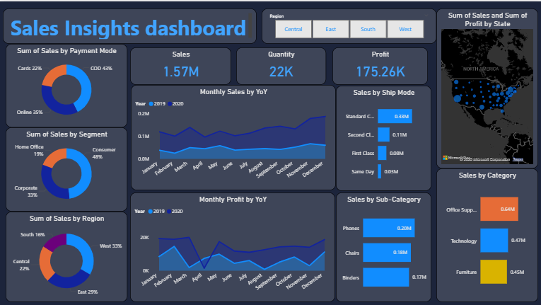
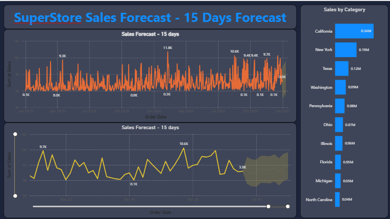

# Sales Dashboard with Time Series Analysis – Power BI

## Objective
To empower business decision-making by analyzing sales data, uncovering key trends, and providing accurate short-term sales forecasts using time series techniques with Power BI.

## Description
This project delivers a dynamic Power BI dashboard that:
- Identifies key KPIs  
- Visualizes trends and regional/product breakdowns  
- Applies time series forecasting to project sales for the next 15 days  
- Provides actionable recommendations for business growth  

## Features
- KPI summary dashboard  
- Interactive filters (by region, product, time)  
- Dynamic time series visualizations  
- 15-day sales forecast  
- Detailed product/region drilldowns  
- Actionable insights and suggested actions  

## Screenshots  
### 🔹 Sales Insights Dashboard

### 🔹 15-Day Sales Forecast

## How to Use
1. Download `sales-dashboard.pbix` from this repository.  
2. Open the file with **Power BI Desktop**.  
3. Use filters and navigation to explore sales data, trends, and forecasts.

> **Note:** This dashboard uses simulated/demo data for illustration purposes. To analyze your own data, replace the sample source in Power BI Desktop.

## Data Source
- All data is synthetic and for demonstration only.  
- No actual business/customer data is included.
- The raw sales data is available in [`data/SuperStore_Sales_Dataset.csv`](data/SuperStore_Sales_Dataset.csv).

## Key Insights
- Time series forecasting enables confident short-term planning.  
- Visualizing KPIs brings clear visibility into sales health and trends.  
- Regional/product analysis spots growth opportunities and outliers.  
- Actionable recommendations are generated for continuous improvement.  

## Project Structure
├── Screenshots/ # Dashboard screenshots
├── data/ # Raw dataset (CSV)
├── Sales dashboard.pbix # Power BI file
├── LICENSE
└── README.md
<pre> 
  ## Project Structure 
  ├── screenshots/ 
  ├── data/ 
  ├── Sales dashboard.pbix 
  ├── LICENSE 
  └── README.md 
</pre>
